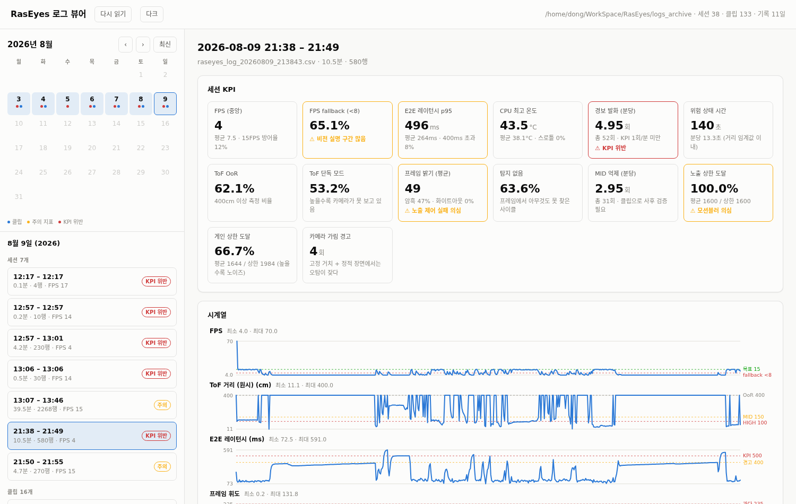
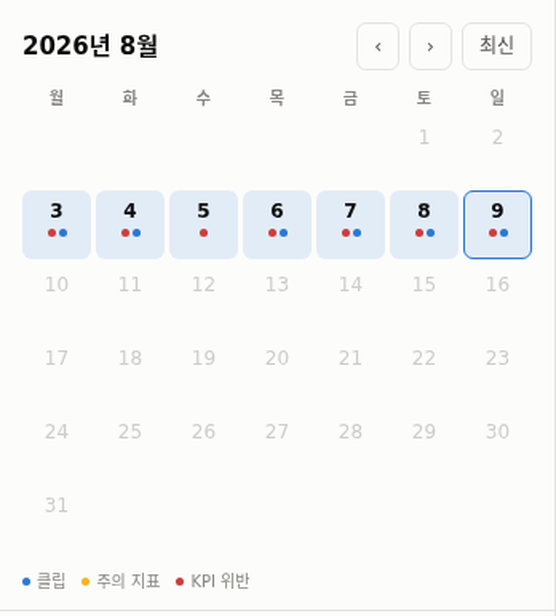
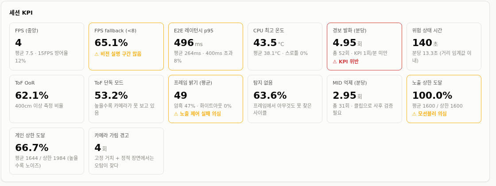
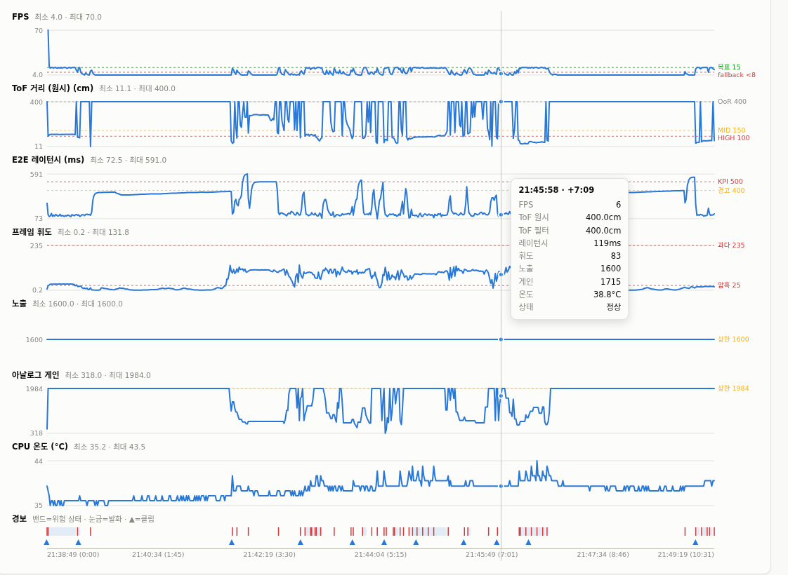
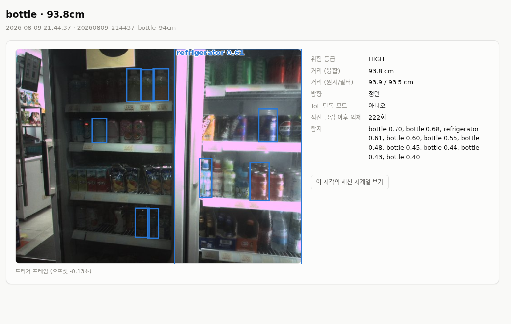

# 2026-08-10 작업 내용 — 로그를 손쉽게 보기

## 지금까지는 로그를 이렇게 봤다

기기는 밖에서 걸을 때마다 **1초에 한 줄씩** 기록을 남긴다. 속도, 온도, 거리, 밝기 같은 것들이다. 경고가 울린 순간에는 **사진도 한 장** 따로 저장한다.

```
── raseyes_log_20260809_213843.csv#0 ──
  FPS       : 평균 7.5 / 중앙 4.0 | 15FPS 방어율 12.0%
  레이턴시  : 평균 264.0ms / p95 496.0ms
  경보 발화 : 52회 | 분당 4.95회 ✗
```

숫자는 맞다. 그런데 이걸로는 알 수 없는 게 있다.

- **언제** 그랬는지 (10분 내내 그랬나, 아니면 30초 동안만 그랬나)
- 그때 **뭐가 보였는지** (사진은 다른 폴더에 있다)
- 여러 숫자가 **같이** 움직였는지 (속도가 떨어질 때 반응도 느려졌나)

사진은 사진대로 흩어져 있었다.



왼쪽이 달력, 오른쪽이 그날 기록이다.

---

## 화면은 네 부분이다

### 1. 달력 — "언제 뭘 했는지"



기록이 있는 날만 파랗게 칠해진다. 아래 점이 그날의 요약이다.

| 점 | 뜻 |
|---|---|
| 🔵 파랑 | 이날 경고 사진이 찍혔다 |
| 🟡 노랑 | 눈여겨볼 지표가 있다 |
| 🔴 빨강 | 목표치를 못 지킨 게 있다 |

날짜를 누르면 그날의 기록이 아래에 뜬다.

**빨간 점만 따라가면 문제 있던 날로 바로 갈 수 있다.**

---

### 2. 성적표



한 번 켜서 끌 때까지를 한 묶음으로 보고, 지표 14개를 카드로 보여준다. 목표를 못 지키면 **테두리에 색이 들어오고 이유가 글로 붙는다.**

> ⚠ KPI 위반 / ⚠ 모션블러 의심 / ⚠ 비전 실명 구간 많음


---

### 3. 그래프 — "언제 발생했는지"



마우스를 올리면 **세로선 하나가 모든 그래프를 관통하고**, 그 시각의 값이 전부 상자에 뜬다. 이게 있어야 "속도가 떨어진 그 순간에 반응도 느려졌나"를 눈으로 확인할 수 있다.

맨 아래 줄은 **경고 기록**이다.

- 연한 파란 띠 = 위험하다고 판단한 구간
- 빨간 세로줄 = 실제로 소리를 낸 순간
- ▲ = 사진이 찍힌 순간 (누르면 그 사진으로 간다)

---

### 4. 사진 — "그때 뭐가 보였나"



경고가 울린 순간의 사진이다. 기기가 찾아낸 물건에 파란 상자를 씌워놨다.

예전 사진은 한 사건에 수십 장씩(보통 36~38장) 저장했는데, 지금은 **결정적인 한 장만** 저장하도록 바꿨다. 그래서 옛날 사진은 **울린 그 순간의 한 장을 골라서** 보여준다. 옛날 것이든 최근 것이든 화면이 똑같다.

오른쪽에 그때의 상황이 적힌다. 위 사진은 편의점 냉장고를 93.8cm 앞에서 만난 것이고, 병 9개와 냉장고를 찾아냈다.

