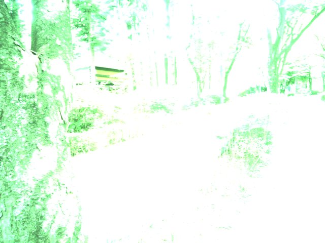

# 2026-07-29 작업 내용

## 오늘 만들려던 것 — 기기가 뭘 봤는지 확인할 수 있게

RasEyes는 머리 높이 장애물을 감지해서 소리로 알려주는 기기다. 그런데 지금까지는 **밖에서 기기가 뭘 보고 뭘 판단했는지 알 방법이 없었다.** "방금 왜 울렸지?" 싶어도 확인할 길이 없으니, 경보가 잘못 울린 건지 제대로 울린 건지 판단할 수가 없다.

그래서 v2.0에서는 기기를 **모니터링할 수 있게** 만드는 데 집중했다.

- **위험 경보가 울리면 그 순간의 영상을 저장한다.** 경보 전 5초, 후 3초를 사진 여러 장으로 남긴다. 나중에 열어보면 "아, 이 의자 때문에 울렸구나"를 알 수 있다.
- **기기 상태를 1초에 한 번씩 기록한다.** 속도(FPS), 온도, 거리, 경보 여부 등을 남긴다.
- **그 기록을 PC로 가져와 분석한다.** 명령어 한 줄로 수집하고, 또 한 줄로 통계를 뽑는다.

기기를 켜보니 예상 못 한 문제가 두 개 발견함;;

## 1. 카메라가 안 켜졌다 — 포트를 바꿔끼운걸 잊고 있었음...

기기를 켜자마자 로그에 같은 에러가 끝없이 찍히고 있었다.

```
카메라 프레임 캡처 실패 — 카메라 연결을 확인하세요
```

원인은 단순했다. **카메라를 다른 포트에 꽂았는데 설정은 그대로였다.**

Orange Pi 5에는 카메라를 꽂을 수 있는 자리가 여러 개 있고, 어느 자리에 꽂았는지를 설정 파일에 적어줘야 한다. 설정에는 예전 포트가 적혀 있는데 카메라는 다른 자리에 있으니, 기기 입장에서는 빈 자리를 계속 들여다보고 있었던 셈이다.

단서는 엉뚱한 데서 나왔다. 카메라 모듈에는 **초점을 맞추는 작은 모터**가 같이 들어 있는데, 이 모터는 카메라 설정과 상관없이 항상 전원이 들어온다. 그래서 이 모터 하나만 다른 자리에서 혼자 신호를 보내고 있었다. **모터가 있는 자리가 곧 카메라가 꽂힌 자리다.**

설정을 그 자리로 바꾸고 재부팅하니 카메라가 살아났다.

한 가지 더 손봐야 했다. 카메라 포트가 바뀌면 **코드에 적힌 장치 이름도 같이 바뀐다.** 코드에 옛날 이름이 그대로 적혀 있어서 두 군데를 실제 이름으로 고쳤다.

| | 고치기 전 | 고친 후 |
|---|---|---|
| 카메라 장치 이름 | `m01_b_ov13855 7-0036` | `m02_b_ov13855 2-0036` |
| 영상 입력 장치 이름 | `rkcif-mipi-lvds` | `rkcif-mipi-lvds1` |

## 2. 카메라가 거꾸로 달려 있었다

카메라가 살아나서 경보를 일부러 울려봤다. 영상은 잘 저장됐다. 그런데 저장된 정보를 열어보니 이상했다.

**사람이 화면을 가득 채우고 있는데 "아무것도 못 찾음"이라고 기록돼 있었다.**

사진을 직접 열어봤더니 이유가 바로 보였다. **영상이 위아래로 뒤집혀 있었다.** 

사람을 알아보는 AI 모델은 **똑바로 선 사람 사진으로 학습**했기 때문에, 거꾸로 뒤집힌 사람은 잘 못 알아본다. 실제로 얼마나 차이 나는지 저장된 사진으로 직접 비교해봤다.

| 사진 | 뒤집힌 상태 (그때) | 똑바로 돌린 뒤 |
|---|---|---|
| 1번 | **아무것도 못 찾음** | 사람 (83%) |
| 2번 | 사람 (70%) | 사람 (84%) |
| 3번 | 사람 (**37%**) | 사람 (88%) |
| 4번 | **노트북 (42%)**, 사람 (27%) | 사람 (88%) |

숫자는 "얼마나 확신하는가"다. 기기는 **40% 미만이면 무시**하도록 되어 있다.

- 3번은 사람을 보고도 37%라서 **3% 차이로 버려졌다.** 똑바로 돌리면 88%가 된다.
- 4번은 사람을 **노트북으로 잘못 봤다.** 사람은 27%로 밀렸다.

즉 카메라가 거꾸로 달려 있다는 것 하나 때문에, **놓치기도 하고 엉뚱하게 알아보기도 하는** 상태였다.

카메라 자체에는 영상을 돌려주는 기능이 없어서, 코드에서 영상을 받자마자 180도 돌리도록 했다. 돌리는 데 걸리는 시간을 실제 기기에서 재보니 **한 장에 0.74밀리초**였다. 한 장을 처리하는 데 쓸 수 있는 시간이 66밀리초니까 **1% 정도**만 쓰는 셈이라 속도에는 영향이 없다.

영상을 **받는 순간에** 돌리기 때문에, AI가 보는 영상과 저장되는 사진이 모두 똑바로 나온다.


## 3. 경보 폭주는 잡혔다

어제 첫 야외 테스트에서 가장 큰 문제는 **경보가 쉴 새 없이 울린 것**이었다. 1분에 181번. 거의 2초에 한 번씩 삐- 소리가 났으니 착용하고 걸어다닐 수준이 아니었다.

원인은 이랬다. 기기는 "1m 안에 뭔가 있으면 위험"이라고 판단하는데, 이건 **켜졌다 꺼졌다 하는 상태**다. 길을 걷다 보면 담벼락이든 지면이든 1m 안에 있는 게 정상이라, 위험 상태가 계속 유지되고 그동안 계속 울렸다.

그래서 **"위험해진 순간"에만 울리도록** 바꿨다.

| | 어제 (7/28) | 오늘 (7/29) |
|---|---|---|
| 경보 횟수 | 분당 **181회** | 분당 **29회** |

84% 줄었다. 목표로 잡았던 "분당 30회 이하"는 넘겼다.

## 4. 조용해진 것과 잘 보게 된 것은 다르다

기기가 조용해졌다고 해서 제대로 보고 있다는 뜻은 아니다. **아무것도 못 보고 있어도 조용하다.** 그래서 저장된 사진을 직접 열어봤다.



*오늘 낮 산책로에서 저장된 사진. 왼쪽 나무 기둥 말고는 전부 하얗게 날아갔다.*

카메라 밝기 조절이 안 되고 있었다. **실내 기준으로 한 번 맞춰놓고 그대로 고정**되어 있어서, 햇빛 아래로 나가면 이렇게 전부 하얗게 타버린다. 반대로 그늘이나 실내로 들어가면 이번엔 캄캄해서 아무것도 안 보인다.

사실상 **카메라로는 아무것도 못 보고 있는 상태**.

그러면 기기는 어떻게 판단했을까? RasEyes에는 카메라 말고 **거리 센서**가 하나 더 있다. 카메라가 못 볼 때를 대비한 예비 수단이다. 오늘은 이 예비 수단에만 의존한 시간이 **96%**였다.

문제는 거리 센서는 **"뭐가 있는지"는 모르고 "얼마나 먼지"만 안다**는 것이다. 앞이 사람인지 담벼락인지 바닥인지 구분이 안 되니까, 산책로 바닥이든 석축이든 1m 안에 들어오면 전부 장애물로 치고 울린다. 오늘 경보의 대부분이 이렇게 나갔다.

즉 **경보를 줄인 건 증상을 가린 것에 가깝고, 진짜 원인인 카메라는 그대로**다.

> ⚠️ 지금 상태로는 실제 보행 보조 용도로 쓰면 안 된다. 테스트 목적으로만 착용하고 있다.

---

## 5. 다음에 할 일

### 1순위 — 카메라 밝기 자동 조절

### 2순위 — 거리 센서 다듬기
